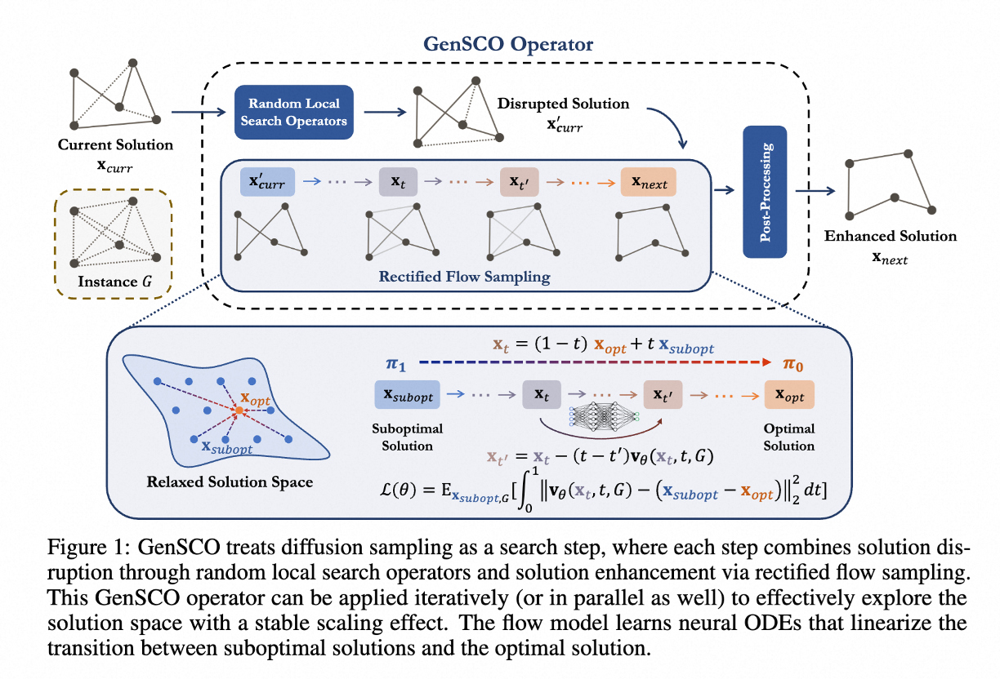
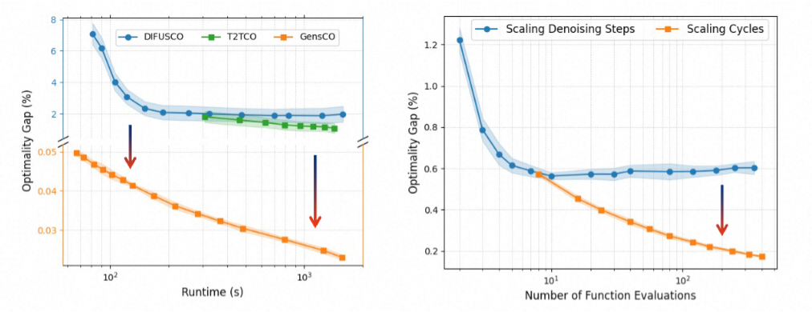

# GenSCO: Generation as Search Operator for Test-Time Scaling of Diffusion-Based Combinatorial Optimization


Official implementation of **NeurIPS 2025** paper "[Generation as Search Operator for Test-Time Scaling of Diffusion-Based Combinatorial Optimization](https://openreview.net/forum?id=9JM03CQwzC)".

While diffusion models have shown promise for combinatorial optimization (CO), their inference-time scaling cost-efficiency remains relatively underexplored. Existing methods improve solution quality by increasing denoising steps, but the performance often becomes saturated quickly. This paper proposes GenSCO to systematically scale diffusion solvers by an orthogonal dimension of inference-time computation beyond denoising step expansion, i.e., search-driven generation. GenSCO takes generation as a search operator rather than a complete solving process, where each operator cycle combines solution disruption (via local search operators) and diffusion sampling, enabling iterative exploration of the learned solution space. Rather than over-refining current solutions, this paradigm encourages the model to leave local optima and explore a broader area of the solution space, ensuring a more consistent scaling effect. The search loop is supported by a search-friendly solution-enhancement training procedure that incorporates a rectified flow model learning to establish diffusion trajectories between suboptimal solutions and the optimal ones. The flow model is empowered by a lightweight transformer architecture to learn neural ODEs that linearize solution trajectories, accelerating convergence of the scaling effect with efficiency. The resulting enhanced scaling efficiency and practical scalability lead to synergistic performance improvements. Extensive experiments show that GenSCO delivers performance improvements by orders of magnitude over previous state-of-the-art neural methods. Notably, GenSCO even achieves significant speedups compared to the state-of-the-art classic mathematical solver LKH3, delivering a 141x speedup to reach 0.000\% optimality gap on TSP-100, and approximately a 10x speedup to reach 0.02\% on TSP-500. 





## Setup
```
sh install.sh
cd lib && make
```

## Checkpoints
Checkpoints can be downloaded from [Google Drive](https://drive.google.com/drive/folders/1hJCAvDy6AkAjslcqCnAJ08ouuNVGXRoH?usp=sharing). To evaluate them, run the scripts in the `scripts/eval` directory.

## Training  
Training scripts are located in `scripts/train`.  

- The TSP-100/500 training data is sourced from [ML4TSPBench](https://github.com/Thinklab-SJTU/ML4TSPBench), TSP-1000 training data is sourced from [ML4CO-Bench-101](https://github.com/Thinklab-SJTU/ML4CO-Bench-101).
- The MIS training data is the same as that used in [Fast-T2T](https://github.com/Thinklab-SJTU/Fast-T2T).  
- The MCL training data is sourced from [ML4CO-Bench-101](https://github.com/Thinklab-SJTU/ML4CO-Bench-101).  

The data formats have been converted using the scripts `data/mis_convert_fmt.py` and `data/mcl_convert_fmt.py`, respectively. For validation, we recommend using Gap directly as the metric rather than validation loss.


